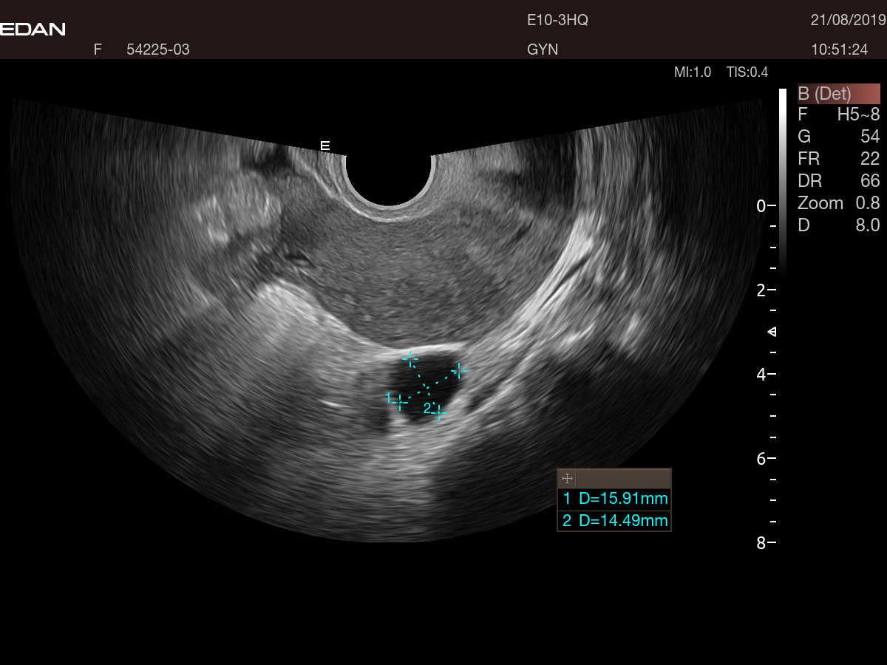
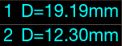
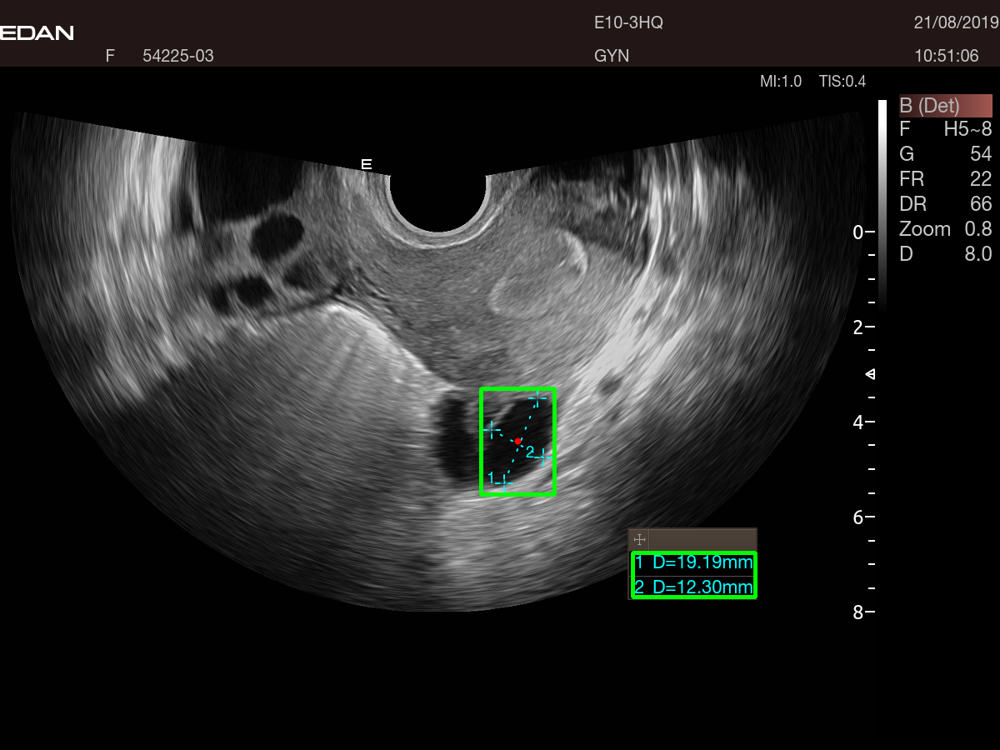
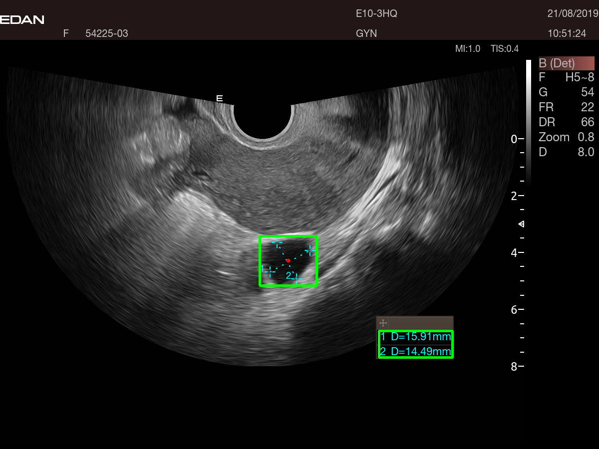

# detect center point and grab the information

## Example image

## Detect cross
  

## Detect text box
  

## results

  

## requirement

 - [pytesseract](https://pypi.org/project/pytesseract/)
 - [cv2](https://opencv-python-tutroals.readthedocs.io/en/latest/py_tutorials/py_gui/py_image_display/py_image_display.html)
 - [glob](https://docs.python.org/3/library/glob.html)
 
 

